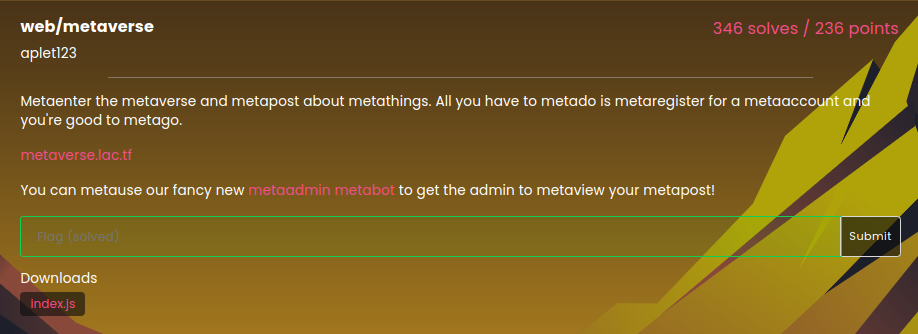
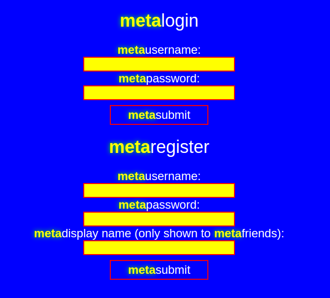
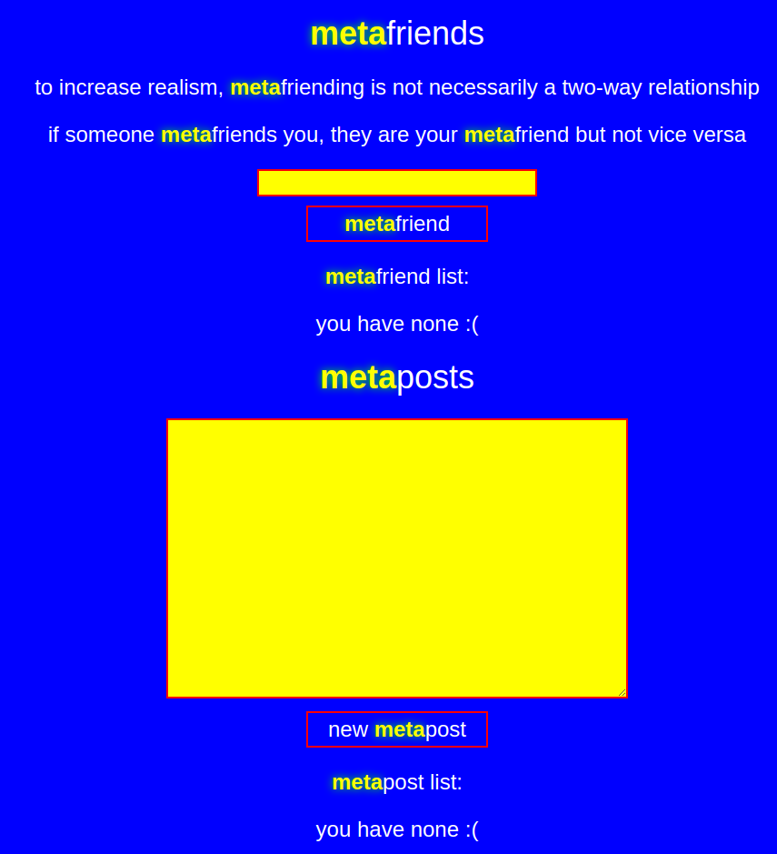
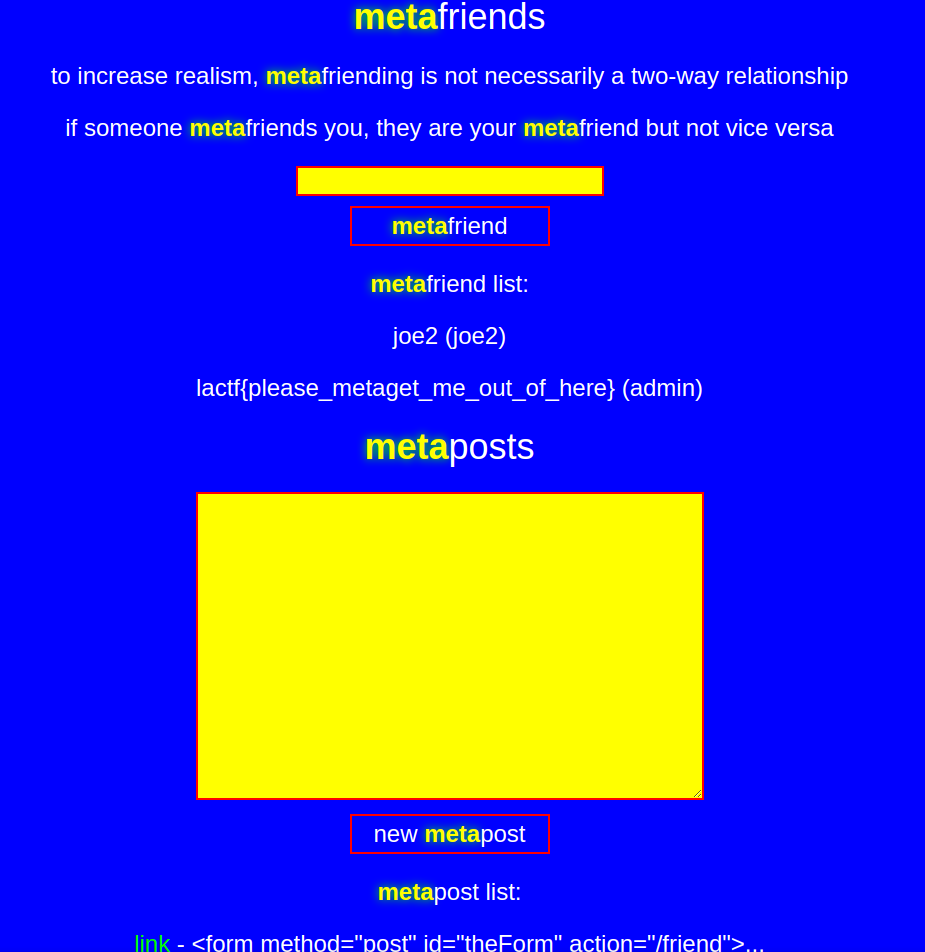

### Larry Liu | LA CTF 2023 | Metaverse | 2/14/2023

LA CTF 2023 had a lot of well made Web challenges. In this writeup, I will be detailing how I solved their **Metaverse** Challenge. 



Their challenge was a mock social media app based on Mark Zuckerberg's endeavors. Their webpage was a login page where I could make an account. 



Registering a new account brought me to this dashboard, where I could see "metafriends" and create "metaposts." 



Creating metaposts creates seperate pages that can be linked, displaying the text. A quick test showed that I could run arbritrary javascript with the posts, indicating that this was an XSS challenge.

```html
<script>alert('123')</script>
```

We can use the admin bot to view our posts. An examination of the source code shows us that the admin account's display name is set to the flag, which is what is shown in the metafriends section. Having the admin bot friend my account would give me the flag, which I did with the following payload:

```html
<form method="post" id="theForm" action="/friend"><input type="hidden" name="username" value="MrLarryMan"> <script> document.getElementById('theForm').submit()</script>
```



With that, I stole the flag and solved the challenge!
