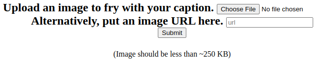
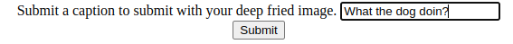
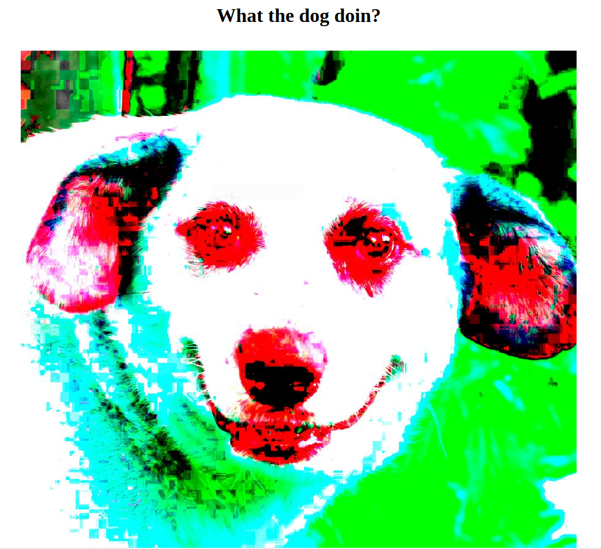
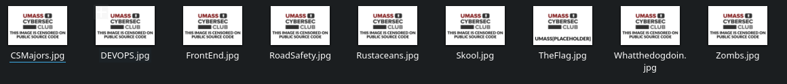
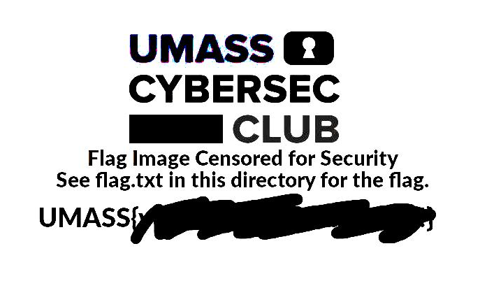
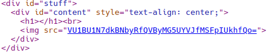

### Larry Liu | UMassCTF 2023 | DeepFried | 4/11/2023 ###

I wrote my first CTF challenge during UMassCTF 2023, a node express website with a SSRF/LFI exploit. The challenge was intended to be beginner-oriented and was the most solved challenge in the CTF with 148 solves. In this writeup, I will be detailing the intended way to solve **DeepFried**. 




My challenge was a website where users could upload .jpg images to deepfry (Intentionally distort an image, such as by oversaturating it and adding noise). Users could either upload their own images from their system or submit urls. Upon submitting an image, it would be stored and users would then be prompted for a caption and then recieve their fried image in the form of a base64 encoded image rendered on the page. 

<figure><figcaption align = "center"><b>A Deep Fried image of a Funny Dog</b></figcaption></figure>

Upon inspection of the source code, we find a folder called restricted_memes. In it, there is a flag.jpg image. 

Logically, accessing the image from the server would give us the flag. There are two ways to do this. The image could be fetched through the URL field as the images in restricted_memes are served statically. The server only allows requests from localhost to acess the memes in the folder and the code disallows having the string "localhost" in the URL. However, "127.0.0.1" also works, so setting the url of the image we want to fry to "http:127.0.0.1:3000/restricted_memes/TheFlag.jpg" will net us the flag. 

An alternative way to access TheFlag.jpg is to modify the cookie during the caption submit stage. The cookie is set to the relative path of the image to be rendered in the uploads directory. There is a check in the code that removes "../" from the code to prevent accessing files from outside the uploads folder, but it can be subverted with the string "....//". Changing the cookie to "....//restricted_memes/TheFlag.jpg" yields us the flag image.



Our work is not yet done, however, as the flag is censored on the image. We are told to check the flag.txt file for the actual flag. If we accessed the image via its URL, it would seem that we would not be able to go further, as urls must be jpgs.
```javascript
if(!(path.extname(url) == '.jpg' || '.jpeg')) {
    return res.status(400).send("Invalid file type. Expected \".jpg\" or \".jpeg\"");
}
```
However, there is a bug in the check that allows all types of files to be fetched. This is because nonempty Javascript strings are truthy, and the second clause of the if statement is only on the string. Thus, passing in "http:127.0.0.1:3000/restricted_memes/flag.txt" would net us the flag.

For the cookie method, simply modifying it to "....//restricted_memes/flag.txt" would work.


Of course, the flag is a text file, meaning it fails to render as an image. To recover the flag, we must take the base64 encoded text from the source data and decode it.



This decodes into

```
UMASS{v@Mo$_APr0nTaR_1!i!I!}
```

With that, the flag is stolen!

---

Overall, I had a lot of fun writing this challenge. I was able to learn a lot about Javascript and the challenge-making process from it. In retrospect, I could have made it a little harder by also blocking 127.0.0.1 so that users must use the ipv6 loopback address which is more obscure, and being more stringent with how the filepath was checked.

Special thanks to Ayman for helping me out with the challenge making process.